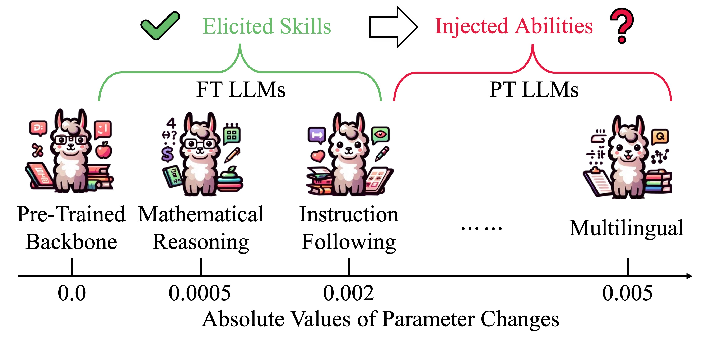
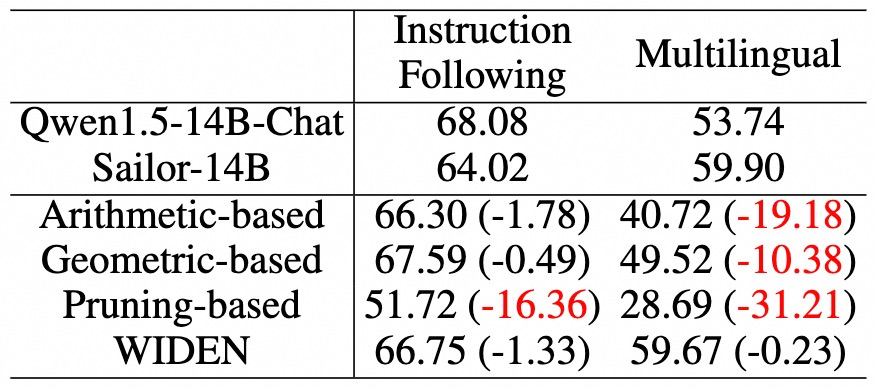

# Extend Model Merging from Fine-Tuned to Pre-Trained Large Language Models via Weight Disentanglement

This repository is built for the paper [Extend Model Merging from Fine-Tuned to Pre-Trained Large Language Models via Weight Disentanglement](https://arxiv.org/abs/2408.xxxxx). 
If you have any questions, please feel free to let us know. You can directly email [Le Yu](https://yule-buaa.github.io/) using the email address yule@buaa.edu.cn or post an issue on this repository.


## Overview

1. We examine the efficacy of current methods in merging Fine-Tuned (FT) and Pre-Trained (PT) LLMs, discovering that they struggle to deal with PT LLMs. 
2. We introduce WIDEN to effectively extend the merging scope from FT to PT LLMs, which first disentangles model weights into magnitude and direction components, and then performs adaptive fusion by considering their respective contributions. 
<div  align="center">  
 
</div>

By conducting experiments, we find that WIDEN successfully injects the multilingual abilities of Sailor into Qwen1.5-Chat and make it proficient in Southeast Asian languages, achieving enhancements in the fundamental capabilities. 
<div  align="center">  
 
</div>


## Large Language Models and Benchmarks 

* We choose Qwen1.5 as the backbone. Qwen1.5-Chat and Sailor are selected as the FT and PT LLMs, respectively. Open LLM Leaderboard and benchmark for South-East Asian languages are used for evaluation.
* We choose Llama 2 as the backbone. WizardLM, WizardMath, and llama-2-13b-code-alpaca are selected as the FT LLMs. We evaluate on five datasets: AlpacaEval 2.0 (instruction following), GSM8K and MATH (mathematical reasoning), and HumanEval and MBPP (code generation).


## Model Merging Methods

We implement eight model merging methods in this repository, including 
[Average Merging](https://arxiv.org/abs/2203.05482), 
[Task Arithmetic](https://arxiv.org/abs/2212.04089), 
[SLERP](https://dl.acm.org/doi/pdf/10.1145/325165.325242),
[Model Stock](https://arxiv.org/abs/2403.19522),
[TIES-Merging](https://arxiv.org/abs/2306.01708),
[Breadcrumbs](https://arxiv.org/abs/2312.06795), 
[DARE](https://arxiv.org/abs/2311.03099), and 
the proposed [WIDEN](https://arxiv.org/abs/2408.xxxxx).


## Project Architecture

The architecture of this project is similar to that of [MergeLM repository](https://github.com/yule-BUAA/MergeLM). 
We provide GSM8K, MATH, and MBPP datasets in ```math_code_data/``` folder. Other datasets can be downloaded during evaluation. For language models, you need to manually download them. 
You can also modify the ```cache_dir``` in the ```utils/load_config.py``` file to specify your own path to save datasets and models.
- figures
- math_code_data （test data for GSM8K, MATH, and MBPP）
  - gsm8k_test.jsonl
  - MATH_test.jsonl
  - mbpp.test.jsonl
- model_merging_methods
  - mask_weights_utils.py -> parameter pruning 
  - merging_methods.py -> eight model merging methods
  - task_vector.py
- utils
  - evaluate_llms_utils.py -> utils for evaluating FT LLMs
  - load_config.py
  - utils.py
- inference_llms.py -> inference LLMs with parameter pruning
- inference_merged_llms_instruct_math_code.py -> inference the merging of FT LLMs 
- merge_llms.py -> merge homologous LLMs, support both FT and PT LLMs


## Environments

We use two environments for merging and evaluation.
* For the merging and evaluation of FT and PT LLMs, the main environments are: PyTorch 2.1.2, transformers 4.40.0.
* For the merging and evaluation of FT LLMs, the main environments include: PyTorch 2.0.1, transformers 4.33.1, and vllm 0.1.4.


## Scripts for Merging and Evaluation

### Merging FT and PT LLMs
* Example of merging *Qwen1.5-7B-Chat* and *Sailor-7B*:
```{bash}
python merge_llms.py --models_to_merge Sailor-7B Qwen1.5-7B-Chat --pretrained_model_name Qwen1.5-7B --merging_method_name average_merging
python merge_llms.py --models_to_merge Sailor-7B Qwen1.5-7B-Chat --pretrained_model_name Qwen1.5-7B --scaling_coefficient 1.0 --merging_method_name task_arithmetic
python merge_llms.py --models_to_merge Sailor-7B Qwen1.5-7B-Chat --pretrained_model_name Qwen1.5-7B --slerp_t 0.7 --dot_threshold 0.9995 --merging_method_name slerp_merging
python merge_llms.py --models_to_merge Sailor-7B Qwen1.5-7B-Chat --pretrained_model_name Qwen1.5-7B --merging_method_name stock_merging
python merge_llms.py --models_to_merge Sailor-7B Qwen1.5-7B-Chat --pretrained_model_name Qwen1.5-7B --param_value_mask_rate 0.5 --scaling_coefficient 0.5 --merging_method_name ties_merging
python merge_llms.py --models_to_merge Sailor-7B Qwen1.5-7B-Chat --pretrained_model_name Qwen1.5-7B --param_density 0.9 --param_value_mask_rate 0.05 --scaling_coefficient 0.5 --merging_method_name breadcrumbs_merging
python merge_llms.py --models_to_merge Sailor-7B Qwen1.5-7B-Chat --pretrained_model_name Qwen1.5-7B --above_average_value_ratio 1.0 --score_calibration_value 1.0 --merging_method_name widen_merging
```

### Evaluation for the Merging of FT and PT LLMs
Open LLM Leaderboard and South-East Asian language benchmark are used for evaluation. Please refer to [lm-evaluation-harness](https://github.com/EleutherAI/lm-evaluation-harness) and [sailor-llm](https://github.com/sail-sg/sailor-llm) to install the required environments. 

* Example for evaluating Average Merging on Winogrande in Open LLM Leaderboard: 
```{bash}
model_path=./save_merge_llms/Qwen1.5-7B/Sailor-7B_Qwen1.5-7B-Chat/average_merging
tokenizer_path=./save_merge_llms/Qwen1.5-7B/Sailor-7B_Qwen1.5-7B-Chat/average_merging/Qwen1.5-7B-Chat
task_name=winogrande
num_fewshot=5
model_name=Qwen1.5-7B/Sailor-7B_Qwen1.5-7B-Chat/average_merging
lm_eval --model hf --model_args pretrained=$model_path,tokenizer=$tokenizer_path --tasks $task_name --device cuda --num_fewshot $num_fewshot --batch_size 1 --output_path lm_eval_outputs/$task_name/$model_name
```

* Example for evaluating Average Merging on XQuAD (th) in South-East Asian language benchmark: 
```{bash}
model_path=./save_merge_llms/Qwen1.5-7B/Sailor-7B_Qwen1.5-7B-Chat/average_merging
tokenizer_path=./save_merge_llms/Qwen1.5-7B/Sailor-7B_Qwen1.5-7B-Chat/average_merging/Sailor-7B
model_name=Qwen1.5-7B/Sailor-7B_Qwen1.5-7B-Chat/average_merging
python ../opencompass/run.py --datasets xquad_th_34e7ab --hf-path $model_path --tokenizer-path $tokenizer_path --model-kwargs device_map='auto' trust_remote_code=True --tokenizer-kwargs padding_side='left' truncation='left' use_fast=False trust_remote_code=True --max-out-len 100 --max-seq-len 4096 --batch-size 8 --num-gpus 1 --work-dir opencompass_outputs/$model_name --max-num-workers 64 
```

### Merging FT LLMs
* Example of merging *WizardLM-13B-V1.2* and *WizardMath-13B-V1.0*:
```{bash}
python merge_llms.py --models_to_merge WizardLM-13B-V1.2 WizardMath-13B-V1.0 --pretrained_model_name Llama-2-13b-hf --merging_method_name average_merging
python merge_llms.py --models_to_merge WizardLM-13B-V1.2 WizardMath-13B-V1.0 --pretrained_model_name Llama-2-13b-hf --scaling_coefficient 1.0 --merging_method_name task_arithmetic
python merge_llms.py --models_to_merge WizardLM-13B-V1.2 WizardMath-13B-V1.0 --pretrained_model_name Llama-2-13b-hf --slerp_t 0.5 --dot_threshold 0.9995 --merging_method_name slerp_merging
python merge_llms.py --models_to_merge WizardLM-13B-V1.2 WizardMath-13B-V1.0 --pretrained_model_name Llama-2-13b-hf --merging_method_name stock_merging
python merge_llms.py --models_to_merge WizardLM-13B-V1.2 WizardMath-13B-V1.0 --pretrained_model_name Llama-2-13b-hf --param_value_mask_rate 0.5 --scaling_coefficient 1.0 --merging_method_name ties_merging
python merge_llms.py --models_to_merge WizardLM-13B-V1.2 WizardMath-13B-V1.0 --pretrained_model_name Llama-2-13b-hf --param_density 0.9 --param_value_mask_rate 0.05 --scaling_coefficient 0.5 --merging_method_name breadcrumbs_merging
python merge_llms.py --models_to_merge WizardLM-13B-V1.2 WizardMath-13B-V1.0 --pretrained_model_name Llama-2-13b-hf --above_average_value_ratio 1.0 --score_calibration_value 1.0 --merging_method_name widen_merging
python merge_llms.py --models_to_merge WizardLM-13B-V1.2 WizardMath-13B-V1.0 --pretrained_model_name Llama-2-13b-hf --mask_apply_method average_merging --merging_method_name mask_merging --weight_mask_rate 0.5 --use_weight_rescale
```

### Evaluation for the Merging of FT LLMs
Firstly, we should perform inference on the merged model for three tasks.
* Example for inference with Average Merging:
```{bash}
python inference_merged_llms_instruct_math_code.py --models_to_merge WizardLM-13B-V1.2 WizardMath-13B-V1.0 --pretrained_model_name Llama-2-13b-hf --merging_method_name average_merging --evaluate_source_model_name WizardLM-13B-V1.2 --evaluate_task instruct
python inference_merged_llms_instruct_math_code.py --models_to_merge WizardLM-13B-V1.2 WizardMath-13B-V1.0 --pretrained_model_name Llama-2-13b-hf --merging_method_name average_merging --evaluate_source_model_name WizardMath-13B-V1.0 --evaluate_task math
python inference_merged_llms_instruct_math_code.py --models_to_merge WizardLM-13B-V1.2 WizardMath-13B-V1.0 --pretrained_model_name Llama-2-13b-hf --merging_method_name average_merging --evaluate_source_model_name WizardLM-13B-V1.2 --evaluate_task code
```
Then, after the inference, for GSM8K and MATH, the metrics will be directly reported. 
For AlpacaEval, HumanEval, and MBPP, we need to run the following evaluation commands to get the final metrics.

* Example for evaluating Average Merging on AlpacaEval:\
Please first see [alpaca_eval repository](https://github.com/tatsu-lab/alpaca_eval) to install the environment. 
Then, run
```{bash}
alpaca_eval --model_outputs ./save_gen_instruct_responses_results/Llama-2-13b-hf/WizardLM-13B-V1.2_WizardMath-13B-V1.0/alpaca_eval/average_merging.json --annotators_config weighted_alpaca_eval_gpt4_turbo --name Llama-2-13b-hf/WizardLM-13B-V1.2_WizardMath-13B-V1.0/alpaca_eval/average_merging
```

* Example for evaluating Average Merging on HumanEval:\
Please first see [human-eval repository](https://github.com/openai/human-eval) to install the environment.
Then, run
```{bash}
evaluate_functional_correctness ./save_gen_codes_results/Llama-2-13b-hf/WizardLM-13B-V1.2_WizardMath-13B-V1.0/human_eval/average_merging.jsonl
```

* Example for evaluating Average Merging on MBPP:\
Please first see [bigcode-evaluation-harness repository](https://github.com/bigcode-project/bigcode-evaluation-harness) to install the environment.
Then, run
```{bash}
accelerate launch ../bigcode-evaluation-harness/main.py --tasks mbpp --allow_code_execution --load_generations_path ./save_gen_codes_results/Llama-2-13b-hf/WizardLM-13B-V1.2_WizardMath-13B-V1.0/mbpp/average_merging.jsonl
```


## Acknowledgments

This project is developed based on [MergeLM](https://github.com/yule-BUAA/MergeLM), [mergekit](https://github.com/arcee-ai/mergekit), [sailor-llm](https://github.com/sail-sg/sailor-llm), and [WizardLM](https://github.com/nlpxucan/WizardLM). We thank the authors for making their codes publicly available.


## Citation

Please consider citing our paper when using this project.
```{bibtex}
@article{yu2024extend,
  title={Extend Model Merging from Fine-Tuned to Pre-Trained Large Language Models via Weight Disentanglement},
  author={Yu, Le and Yu, Bowen and Yu, Haiyang and Huang, Fei and Li, Yongbin},
  journal={arXiv preprint arXiv:2408.xxxxx},
  year={2024}
}
```
